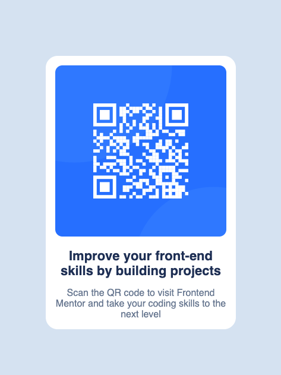

# QR Code Component

This is a solution to the QR Code Component challenge on Frontend Mentor. The goal was to build a responsive card layout that displays a QR code and descriptive text.

## 📸 Screenshot

## 🔗 Links

- Live Site: https://yourusername.github.io/qr-code-component
- Repository: https://github.com/yourusername/qr-code-component

## 🛠️ Built with

- Semantic HTML5
- CSS Flexbox
- Responsive design principles

## 📚 What I learned

I improved my understanding of layout structuring using Flexbox, especially for centering elements both vertically and horizontally. I also practiced setting up and managing a GitHub repository correctly.

## 🚀 Continued development

I want to keep improving my CSS skills, particularly in spacing, typography, and writing more scalable styles for larger projects.

## 👤 Author

- GitHub - [yourusername](https://github.com/yourusername)
